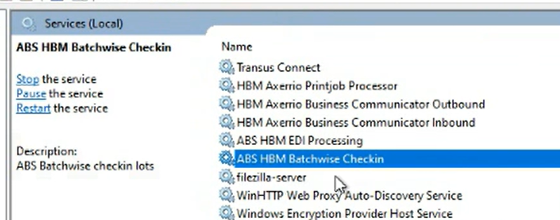

>>// 

# Case 5.1 — Batchwise Check-in
**Pattern:** A — Service Restart | **Guidebook section:** 5.1

---

## Trigger phrases — what the customer says

| Phrase | Time of call | Probability |
|---|---|---|
| "no labels after checking in" / "checking in all morning, nothing happening" | 05:00–09:00 | Very high |
| "lots not getting labels after check-in" | 05:00–09:00 | Very high |
| "lots are checked in but not appearing" | 05:00–09:00 | High |

---

## Step-by-step resolution

Follow in order. If the fix works at any step, confirm with the customer and close.

**Step 1 — Identify the server**
Query Confluence for the customer: https://vertical.atlassian.net/wiki/spaces/A/pages/6321869774/ABS+Services+locations+customers
Look up the **ABS Windows Services** column for this customer. This is the server hosting the Batchwise Check-in service.

**Step 2 — RDP to the server and open Windows Services**
RDP to the server identified in Step 1.
Open **Windows Services** (services.msc).
Sort by **Log On As** column to group ABS services together — this makes the service easier to find.



**Step 3 — Find the Batchwise Check-in service**
Locate the service named **"Batchwise Check-in"** (or similar — the exact name may include the customer code prefix).


**Step 4 — Restart the service**
Stop the service. Wait **8–10 seconds**. Start the service.


Do not restart immediately — the wait allows dependent processes to release handles.

**Step 5 — Verify via Lot Identification Jobs**
In ABS, open **Lot Identification Jobs** (Kavel Identificatie Jobs).
Check the status of recent jobs. Expected result: status changes from **None** or **Entered** → **Checked In**.
Confirm with the customer that labels are now being generated.


**Step 6 — Optional: database verification (if visual confirmation is unclear)**
If the ABS interface does not clearly confirm resolution, run the following query on the ABS database:

```sql
SELECT TOP 100 * FROM <ABS-db>.dbo.PartyIdentificationJob ORDER BY LotIdentificationJobKey DESC
```

Confirm that recent jobs have a processed/completed status.

> ⚠️ **PENDING — confirm before using in a live call:**
> Exact ABS database name for this customer. The placeholder `<ABS-db>` must be replaced with the actual database name. Look up via SQL Server Management Studio (SSMS) on the server, or ask the customer's DBA.
> *Confirm with: Martijn | Added: 2026-06-08*

**Step 7 — If still failing after service restart: check print queue and ALPS**
If the service is running but labels still do not appear:
1. Check the **print queue** on the server — a stuck print job may be blocking output.
2. Restart the **Print Spooler** service on the ALPS server (may be a separate server for large customers — check Confluence ALPS column).
3. Run a network connectivity test from the ALPS server to the label printer:
   ```
   Test-NetConnection <printer-ip> -port <printer-port>
   ```
   If this fails, proceed to Case 5.7 (Connection Problems).

**Step 8 — Escalate to Tier 2**
If unresolved, or at the 20-minute mark — stop and escalate.
Tell the agent: "Proceed to escalate to Tier 2."
Brief to give the specialist: customer name, time check-in started failing, service status found, what was restarted, result of Lot Identification Jobs check.

---

## Important nuances

> ⚠️ Not all blank lot statuses mean the service is down. If only some lots are missing labels, check whether the **Checkindepartmentgroups** configuration includes those lot types. A misconfiguration produces the same symptom as a stopped service.

> ⚠️ For large customers, the ALPS (Axerrio Print Job Processor) service may be on a **separate dedicated server**, not the same AST server as Batchwise Check-in. Check the **ALPS** column in Confluence separately.

---

## Quick summary

If a customer says "no labels after checking in":
1. Confluence → ABS Windows Services column → identify server
2. RDP → services.msc → sort by Log On As → find Batchwise Check-in
3. Stop → wait 8–10s → Start
4. Verify in ABS: Lot Identification Jobs → status = Checked In
5. If still failing → check print queue → restart Print Spooler → Test-NetConnection → Case 5.7 if network fails
6. If unresolved at 20 min → escalate to Tier 2

\\<<
