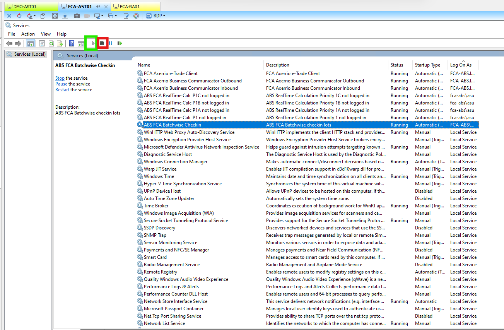

>>// 

# Case 5.1 — Batchwise Check-in
**Pattern:** A — Service Restart | **Guidebook section:** 5.1

---

## Trigger phrases — what the customer says

| Phrase | Time of call | Probability |
|---|---|---|
| "no labels after checking in" / "checking in all morning, nothing happening" | 05:00–09:00 | Very high |
| "lots not getting labels after check-in" | 05:00–09:00 | Very high |
| "lots are checked in but not appearing" | 05:00–09:00 | High |

---

## Step-by-step resolution

Follow in order. Do not skip steps. Do not suggest actions that are not listed here.

**Step 1 — Identify the server**
Query Confluence for the customer: https://vertical.atlassian.net/wiki/spaces/A/pages/6321869774/ABS+Services+locations+customers
Look up the **ABS Windows Services** column for this customer. This is the server hosting the Batchwise Check-in service.

**Step 2 — RDP to the server and open Windows Services**
RDP to the server identified in Step 1.
Open **Windows Services** (services.msc).
Sort by **Log On As** column to group ABS services together — this makes the service easier to find.


**Step 3 — Find the Batchwise Check-in service**
Locate the service named **"Batchwise Check-in"** (or similar — the exact name may include the customer code prefix).

**Step 4 — Restart the service**
Stop the service. Wait **8–10 seconds**. Start the service.


In 99% of cases where the customer reports this symptom during early hours, this is all that is needed.

**Step 5 — Verify it is working**
After restarting, open the **Lot Identification Jobs** overview in ABS (Partij Identificatie Jobs). Click the icon shown below to open it:



The **timestamp and status columns** should start updating rapidly — changing every few seconds as the service picks up the backlog. Status should change from **"none" or "entered" → "checked in" (Binnengemeld)**.

Ask the customer: "Are labels coming out of the printer now?"
- **Yes** → issue resolved. Log the call in Intercom and close.
- **No** → continue to Step 6.

You can also verify independently via database query. Connect to the customer's SQL server via SSMS (see Confluence → SSMS Location column for the server name — e.g. for FCA: **AXE-SQL10**), then run:

```sql
SELECT TOP 100 * FROM PartyIdentificationJob ORDER BY [Key] DESC
```

If **RunnedTimestamp** is populated and timestamps are recent → service is running and processing. If all NULL → service was not running before restart.

**Step 6 — Check the print queue**
On the AST server, open **Print Management**. Check if labels are stuck in the print queue of the label printer.
If jobs are queued but not printing → **restart the Print Spooler service** on the same server.
Stop Print Spooler → wait 8–10 seconds → Start.


Ask the customer again: "Are labels coming out now?"
- **Yes** → resolved. Log and close.
- **No** → continue to Step 7.

**Step 7 — Network connectivity test**
If Print Spooler restart did not resolve it, the printer may be unreachable.
Proceed to **Case 5.7** (Connection Problems) for network diagnostics.

**Step 8 — Escalate to Tier 2**
If unresolved, or at the 20-minute mark — stop and escalate.
Tell the agent: "Proceed to escalate to Tier 2."
Brief to give the specialist: customer name, time check-in started failing, service status found, what was restarted, result of Lot Identification Jobs check, print queue status.

---

## Important nuances

> ⚠️ Not all blank lot statuses mean the service is down. If only some lots are missing labels, check whether the **Checkindepartmentgroups** configuration includes those lot types. A misconfiguration produces the same symptom as a stopped service.

> ⚠️ For large customers, the ALPS (Axerrio Print Job Processor) service may be on a **separate dedicated server**, not the same AST server as Batchwise Check-in. Check the **ALPS** column in Confluence separately.

---

## Quick summary

If a customer says "no labels after checking in":
1. Confluence → ABS Windows Services column → identify server
2. RDP → services.msc → sort by Log On As → find Batchwise Check-in
3. Stop → wait 8–10s → Start
4. ABS → Lot Identification Jobs → watch timestamps and status update (Binnengemeld) → ask customer if labels are printing
5. Or verify via SSMS (Confluence → SSMS Location column) → `SELECT TOP 100 * FROM PartyIdentificationJob ORDER BY [Key] DESC` → check RunnedTimestamp populated
6. If no → Print Management → check print queue → restart Print Spooler
7. If still no → Case 5.7 (network diagnostics)
8. If unresolved at 20 min → escalate to Tier 2

\\<<
