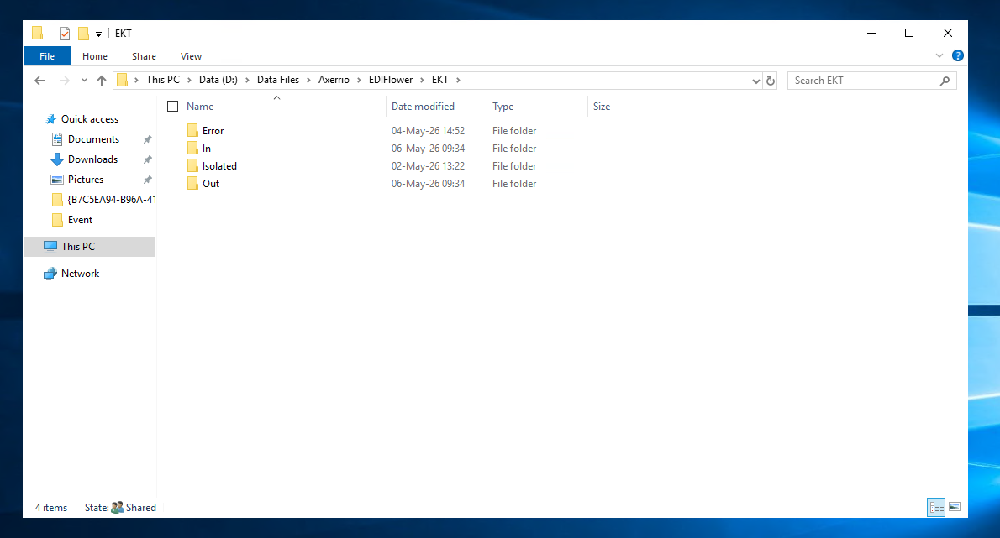
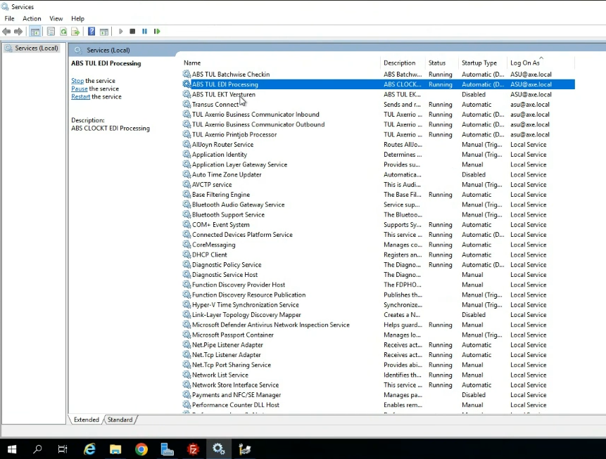
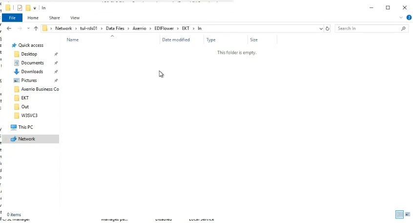

>>// 

# Case 5.2 — EDI Processing
**Pattern:** A — Service Restart | **Guidebook section:** 5.2

---

## Trigger phrases — what the customer says

| Phrase | Time of call | Probability |
|---|---|---|
| "lots not appearing after auction" / "EDI not processed" | 04:00–10:00 | Very high |
| "lots are missing from the system after the auction" | 04:00–10:00 | Very high |
| "EKT files not being processed" | 04:00–10:00 | High |

---

## Step-by-step resolution

Follow in order. If the fix works at any step, confirm with the customer and close.

**Step 1 — Identify the server**
Query Confluence for the customer: https://vertical.atlassian.net/wiki/spaces/A/pages/6321869774/ABS+Services+locations+customers
Look up the **ABS Windows Services** column (and the **EDI Processing** column if separately listed) for this customer.

**Step 2 — Confirm the EDI folder path**
The default EDI input folder is:
```
D:\Data Files\Axerrio\EDIFlower\EKT\
```
Verify the exact path via the ABS setting **EKTPathIN** if the default does not match.

The folder structure contains:
- `IN\` — incoming EKT files waiting to be processed
- `OUT\` — processed files
- `ERROR\` — files that failed processing
- `ISOLATED\` — files quarantined after repeated failures

**Step 3 — Diagnose: check the IN folder**
RDP to the server. Navigate to the `IN\` folder.
If files are older than **10 minutes** and have not moved → the EDI Processing service has stopped.
If the folder is draining normally → the service may already be running. Confirm with the customer before restarting.



**Step 4 — Find the EDI Processing service**
Open **Windows Services** (services.msc).
Locate the service named **"EDI Processing"** (may include customer code prefix).



**Step 5 — Restart the service**
Stop the service. Wait **8–10 seconds**. Start the service.


**Step 6 — Watch the IN folder drain**
Return to the `IN\` folder. Confirm that files are being picked up and moved to `OUT\`.
The folder should begin draining within 1–2 minutes of the service starting.



**Step 7 — Confirm with the customer**
Ask the customer to verify that lots are now appearing in the system. Confirm and close.

**Step 8 — Escalate to Tier 2**
If unresolved, or at the 20-minute mark — stop and escalate.
Tell the agent: "Proceed to escalate to Tier 2."
Brief to give the specialist: customer name, time the issue started, number of files stuck in IN folder, any files in ERROR or ISOLATED, service status found, restart result.

---

## Important nuances

> ⚠️ There are **two separate processes** involved in EDI. The **mail processor** (a PowerShell script) fetches EKT files from the auction and drops them into the IN folder. The **EDI Processing service** reads from the IN folder and processes them into ABS. If the IN folder is empty and lots are still missing, the problem may be with the mail processor — that is a Tier 2 issue, not a service restart.

> ⚠️ After **10:00 AM**, auction volume drops naturally. An empty IN folder after this time does not indicate a problem.

> ⚠️ Files in the `ERROR\` folder indicate processing failures, not a stopped service. If you see files in ERROR after restarting, note this for the Tier 2 escalation — do not attempt to manually reprocess them.

---

## Quick summary

If a customer says "lots not appearing after auction":
1. Confluence → ABS Windows Services / EDI Processing column → identify server
2. RDP → navigate to `D:\Data Files\Axerrio\EDIFlower\EKT\IN\`
3. Files older than 10 min in IN folder → service is stopped
4. services.msc → find EDI Processing → Stop → wait 8–10s → Start
5. Watch IN folder drain → confirm with customer
6. If IN folder is already empty → mail processor issue → Tier 2
7. If unresolved at 20 min → escalate to Tier 2

\\<<
