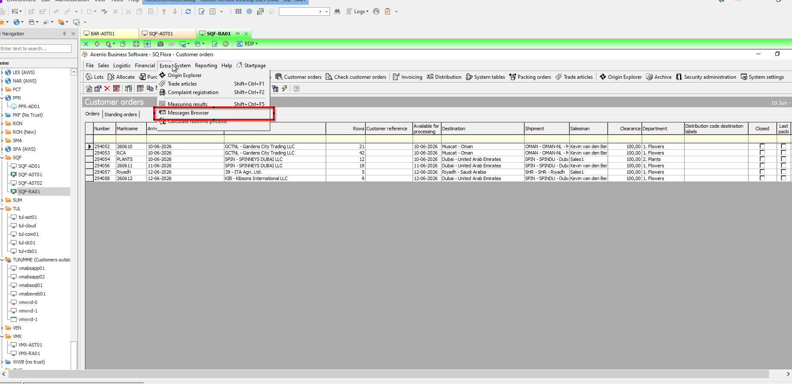
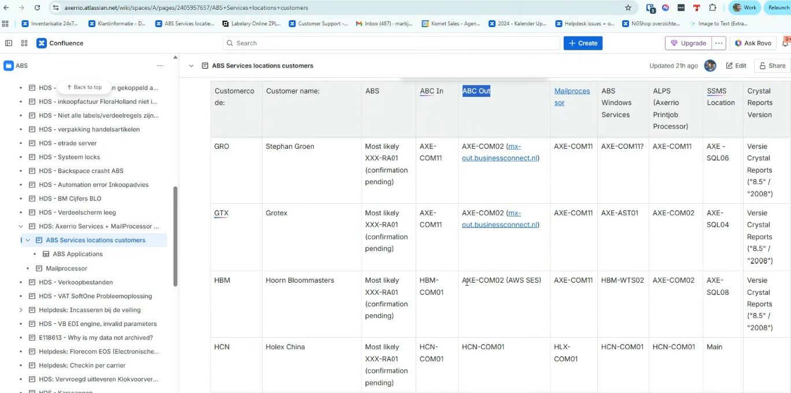
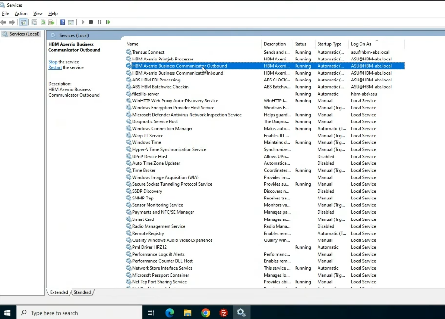
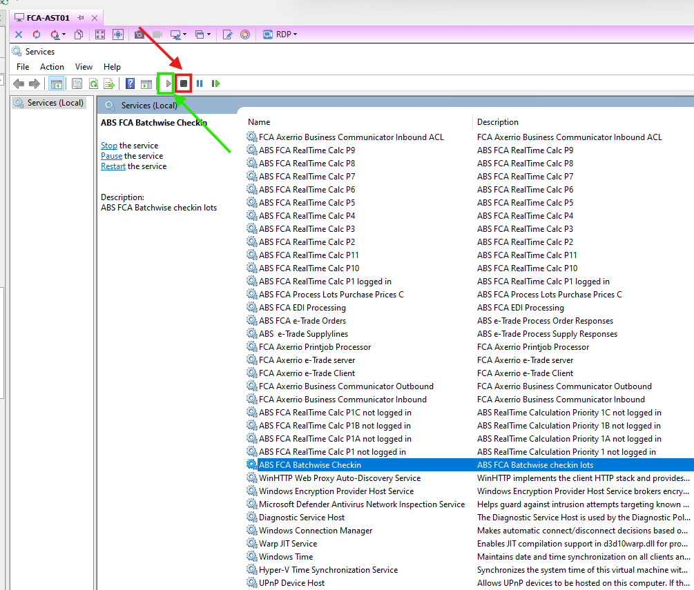
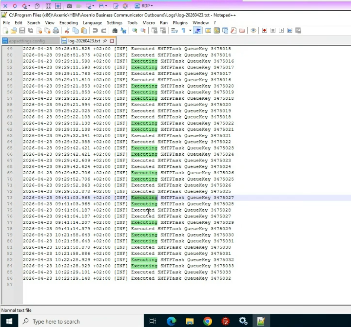

>>// 

# Case 5.3 — ABC Outbound
**Pattern:** A — Service Restart | **Guidebook section:** 5.3

---

## Trigger phrases — what the customer says

| Phrase | Time of call | Probability |
|---|---|---|
| "emails not sent" / "invoices not going out" | Any | Very high |
| "outbound messages stuck" / "customers not receiving invoices" | Any | Very high |
| "Message Browser shows messages not processed" | Any | High |

---

## Step-by-step resolution

Follow in order. If the fix works at any step, confirm with the customer and close.

**Step 1 — Diagnose via the Message Browser in ABS**
Open ABS and navigate to the **Message Browser** (Berichtenoverzicht).
Check the status of recent outbound messages:
- **Processed** → service is healthy, issue may be elsewhere
- **Inserted** or **To be processed** → service is stuck, proceed with restart

> ⚠️ **TIP:** Turn off **auto-refresh** in the Message Browser before applying filters. If auto-refresh is on, the filter resets on each refresh and you cannot hold a filtered view.

**Step 2 — Identify the server**
Query Confluence for the customer: https://vertical.atlassian.net/wiki/spaces/A/pages/6321869774/ABS+Services+locations+customers
Look up the **ABC Out** column for this customer. This is the server hosting the ABC Outbound service.

**Step 3 — Find the ABC Outbound service**
RDP to the server. Open **Windows Services** (services.msc).
Locate the service named **"Axerrio Business Communicator Outbound"** (may include customer code prefix).

**Step 4 — Check the log file before restarting**
Before restarting: right-click the service → **Properties** → note the **Path to executable**.
Navigate to the directory containing the executable. Open the **Logging** subfolder.
Open the most recent log file in **Notepad++** (Notepad++ auto-reloads on change — use it, not plain Notepad).
A **healthy log** shows CronJob entries with recent timestamps, cycling regularly.
A **stuck log** shows no recent entries or an error at the last entry.

**Step 5 — Restart the service**
Stop the service. Wait **8–10 seconds**. Start the service.

**Step 6 — Verify via Message Browser**
Return to ABS → Message Browser. Confirm that the status of recent messages changes to **Processed**.
Watch the log file in Notepad++ — new CronJob entries should appear within 1–2 minutes.

**Step 7 — Escalate to Tier 2**
If unresolved, or at the 20-minute mark — stop and escalate.
Tell the agent: "Proceed to escalate to Tier 2."
Brief to give the specialist: customer name, message statuses found in Message Browser, log file entries at the time of the issue, service status found, restart result.

---

## Important nuances

> ⚠️ The Message Browser status codes (for reference only — do not surface to the customer): 1=Inserted, 2=Being processed, 3=Processed, 4=Failure, 5=Postponed. Status 4 (Failure) or 5 (Postponed) after restart indicates a deeper issue — escalate to Tier 2.

> ⚠️ Always open log files in **Notepad++**, not plain Notepad. Notepad++ auto-reloads when the file changes, making it possible to watch the log live. Plain Notepad shows a static snapshot.

---

## Quick summary

If a customer says "emails not sent" / "invoices not going out":
1. ABS → Message Browser → check for Inserted / To be processed (turn off auto-refresh first)
2. Confluence → ABC Out column → identify server
3. RDP → services.msc → find Axerrio Business Communicator Outbound
4. Properties → Path to executable → Logging subfolder → open log in Notepad++
5. Stop → wait 8–10s → Start
6. Verify: Message Browser → Processed, log file shows new CronJob entries
7. If unresolved at 20 min → escalate to Tier 2

\\<<
