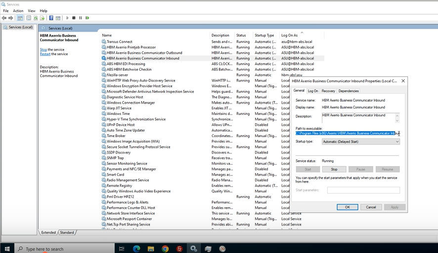
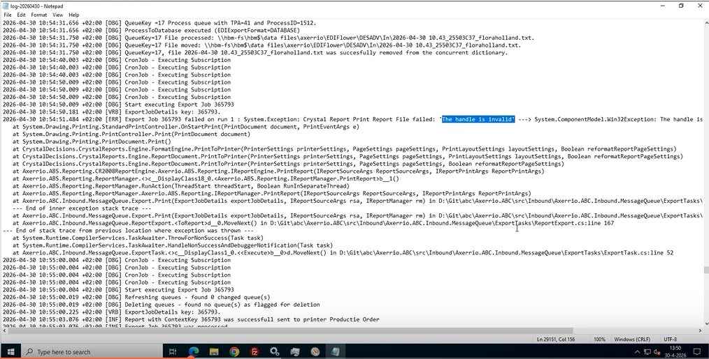

>>// 

# Case 5.4 — ABC Inbound
**Pattern:** A — Service Restart | **Guidebook section:** 5.4

---

## Trigger phrases — what the customer says

| Phrase | Time of call | Probability |
|---|---|---|
| "orders not coming in" / "async invoices not generated" | Any | Very high |
| "inbound messages not processing" / "orders stuck" | Any | Very high |
| "scheduled reports not running" | Any | Medium |

---

## Step-by-step resolution

Follow in order. If the fix works at any step, confirm with the customer and close.

**Step 1 — Identify the server**
Query Confluence for the customer: https://vertical.atlassian.net/wiki/spaces/A/pages/6321869774/ABS+Services+locations+customers
Look up the **ABC In** column for this customer.

**Step 2 — Navigate to the log file — the only diagnostic tool for this service**
There is **no UI diagnostic** for ABC Inbound. The log file is the only way to determine what is happening.

RDP to the server. Open **Windows Services** (services.msc).
Locate the service named **"Axerrio Business Communicator Inbound"** (may include customer code prefix).
Right-click → **Properties** → note the **Path to executable**.
Navigate to the directory containing the executable. Open the **Logging** subfolder.
Open the **most recent log file for today** in **Notepad++**.

**Step 3 — Read the log file and identify the error signature**

Look for the following error signatures:

| Error in log | Meaning | Action |
|---|---|---|
| `"the handle is invalid"` | Service crash — transient, restart fixes it | Restart the service (Step 4) |
| `"memory was completely full"` | Service ran out of memory | Restart the service AND reset affected jobs in queue (Step 5) |
| `"used by another process"` | Warning only — self-resolves | Do NOT restart — monitor for 5 minutes, it will clear |

**Step 4 — Restart the service (for "handle is invalid" or "memory full")**
Stop the service. Wait **8–10 seconds**. Start the service.

Watch the log in Notepad++ for new entries confirming activity.

**Step 5 — If error was "memory was completely full": reset affected jobs in queue**
After restarting, check whether any inbound jobs are stuck in an intermediate state.

> ⚠️ **PENDING — confirm before using in a live call:**
> Exact procedure for resetting affected jobs in the ABC Inbound queue after a memory-full crash. The guidebook notes this is required but does not specify the exact steps (UI location or query).
> *Confirm with: Martijn | Added: 2026-06-08*

**Step 6 — Confirm with the customer**
Ask the customer to verify that orders are now coming in / invoices are being generated. Confirm and close.

**Step 7 — Escalate to Tier 2**
If unresolved, or at the 20-minute mark — stop and escalate.
Tell the agent: "Proceed to escalate to Tier 2."
Brief to give the specialist: customer name, error signature found in log, service status, restart result, whether jobs are still stuck in queue.

---

## Important nuances

> ⚠️ ABC Inbound handles **three functions**: (1) inbound orders from trading partners, (2) **asynchronous outbound invoices** (invoices generated in batches, not triggered by individual send actions), and (3) **scheduled reports**. A customer reporting "invoices not going out" may actually have an ABC Inbound issue, not an ABC Outbound issue. The key differentiator: if the invoice generation is on a schedule or batch, it is Inbound. If it is triggered by a send action in ABS, it is Outbound (Case 5.3).

> ⚠️ The error `"used by another process"` is a **warning only** and self-resolves. Do not restart the service for this error — it will disrupt currently processing messages.

> ⚠️ Always open log files in **Notepad++** for live auto-reload. Do not use plain Notepad.

---

## Quick summary

If a customer says "orders not coming in" / "async invoices not generated":
1. Confluence → ABC In column → identify server
2. RDP → services.msc → Axerrio Business Communicator Inbound → Properties → Path to executable → Logging subfolder → open today's log in Notepad++
3. "handle is invalid" → restart (Stop → wait 8–10s → Start)
4. "memory was completely full" → restart + reset affected jobs in queue (PENDING: confirm procedure)
5. "used by another process" → do NOT restart, monitor 5 min
6. Confirm with customer
7. If unresolved at 20 min → escalate to Tier 2

\\<<
